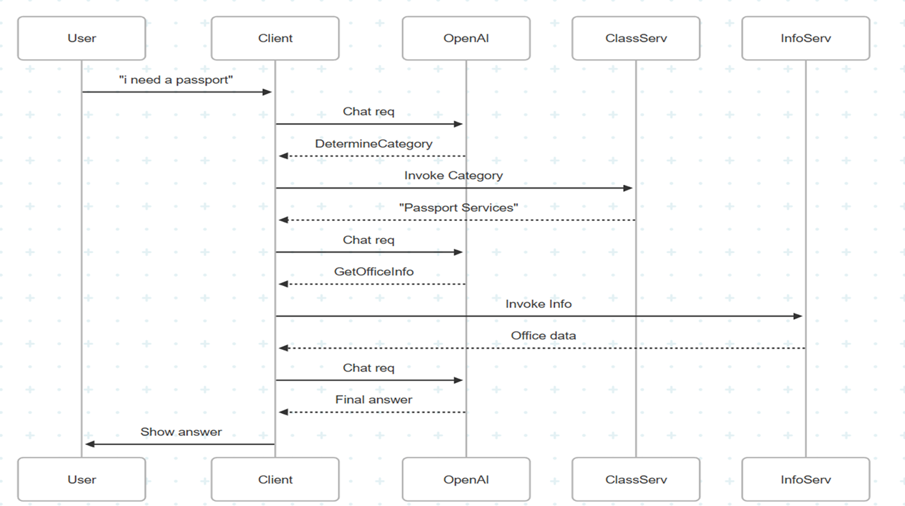
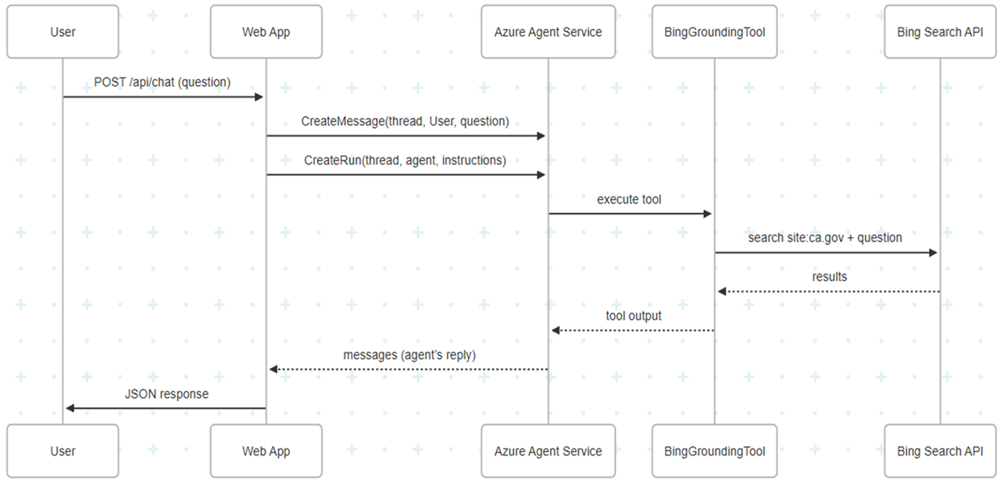

# California State Developer Talk Demos

This repository contains demos for the California State Developer Talk on Semantic Kernel and Model Context Protocol. These demos showcase the integration of advanced AI capabilities into applications using Azure OpenAI and Semantic Kernel.

## Getting Started

To run these demos, follow the steps below:

1. **Deploy a Model**:
   - Deploy an Azure OpenAI model in your Azure subscription.

2. **Retrieve Settings**:
   - Obtain the following settings from your Azure portal:
     - Azure OpenAI Endpoint
     - Azure OpenAI Key
     - Deployment Name

3. **Configure the Application**:
   - Locate the `appsettings.Development.template.json` file in the respective project folder.
   - Rename the file to `appsettings.Development.json`.
   - Update the file with your Azure settings.

Once configured, you can build and run the demos to explore their functionality.

## Projects

### Semantic Kernel Demo

This project demonstrates the use of Semantic Kernel for various AI-driven tasks. It includes the following plugins and semantic functions:

- **TodoPlugin**: Manage a list of tasks by adding or removing them.
- **HolidayPlugin**: Check if a given date is a US public holiday.
- **AdvicePlugin**: Fetch random pieces of advice.
- **Summarize Function**: Summarize a given text into one clear sentence.

The Semantic Kernel is configured to automatically select the most appropriate plugin or function to answer a user's question. This dynamic selection is based on the context and intent of the query, allowing for seamless and intelligent responses.

#### Example Questions
Here are some example questions you can ask to explore the capabilities of this demo:

1. "Add 'Buy groceries' to my to-do list."
2. "Is July 4th a public holiday?"
3. "Give me a piece of advice."
4. "Summarize this text: 'The quick brown fox jumps over the lazy dog.'"

#### How to Run
1. Navigate to the `SkDemo` directory.
2. Update the `appsettings.Development.json` file:
   - Rename `appsettings.Development.template.json` to `appsettings.Development.json` if not already done.
   - Add your Azure OpenAI settings (`Endpoint`, `Key`, `Deployment`, and `ModelId`).
3. Build and run the project using your preferred IDE or the .NET CLI.

---

### Model Context Protocol (MCP) Demo

This demo showcases the integration of the MCPClient with the MCPInfoServer and MCPClassificationServer. The MCPClient is configured to connect to these servers, which dynamically inform the client about the tools they provide. Based on the user's query, the MCPClient intelligently selects the appropriate tools from the available servers to generate a response.



#### How to Run
1. Navigate to the `MCPClient` directory.
2. Update the `appsettings.Development.json` file:
   - Rename `appsettings.Development.template.json` to `appsettings.Development.json` if not already done.
   - Add your Azure OpenAI settings (`Endpoint`, `Key`, `Deployment`, and `ModelId`).
   - Specify the connection details for the `MCPInfoServer` and `MCPClassificationServer`.
3. Build and run the `MCPClient` project using your preferred IDE or the .NET CLI. The client will automatically start the `MCPInfoServer` and `MCPClassificationServer` as needed.

---

### CA Services Chatbot

This project demonstrates a chatbot designed to assist users with California state services. The chatbot uses Azure's Persistent Agents to provide conversational assistance, leveraging Bing grounding searches to ensure accurate and up-to-date information from official CA.gov sources.



#### Key Features
- **Bing Grounding Search**: For every user query, the chatbot performs a fresh Bing search restricted to CA.gov domains, ensuring responses are based on the latest official information.
- **Dynamic Tooling**: The chatbot dynamically provisions tools, such as Bing grounding, to enhance its capabilities.
- **Conversation History**: Maintains a detailed conversation history for context-aware interactions.
- **Automatic Cleanup**: Deletes the agent upon application shutdown to ensure resource management.

#### Prompt Used
The chatbot uses the following prompt to guide its behavior:

```
You are a conversational California services assistant with perfect recall.
**Always** include the official URL for any service or form you mention *in your very first answer*.
For every user query—even follow-ups—immediately perform a fresh Bing grounding search (using `site:ca.gov` plus the question), then return up to 3 official CA.gov links (URLs under `/departments/.../services/...` or equivalent), each with a one-sentence summary. Do NOT answer from memory alone.
```

Feel free to experiment with this prompt to see how it changes the chatbot's responses.

#### How to Run
1. Navigate to the `CaFormsChatbot` directory.
2. Update the `appsettings.Development.json` file:
   - Rename `appsettings.Development.template.json` to `appsettings.Development.json` if not already done.
   - Add your Azure settings:
     - `ProjectEndpoint`
     - `ModelDeploymentName`
     - `BingConnectionId` (Refer to [Create a Bing Search resource in Azure](https://learn.microsoft.com/en-us/azure/ai-services/agents/how-to/tools/bing-grounding) for instructions.)
3. Build and run the project using your preferred IDE or the .NET CLI.

#### Example Questions
- "What are the requirements for a California driver's license?"
- "How do I apply for unemployment benefits in California?"
- "Where can I find information about property taxes in California?"